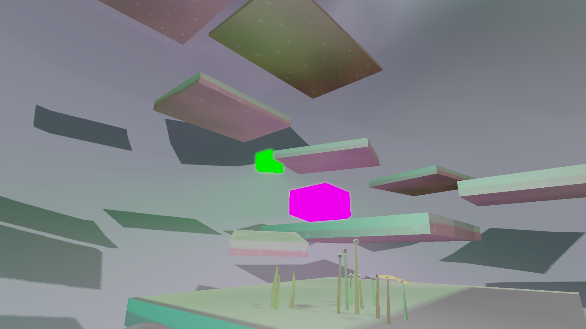

# Lost in Abyss

**Creators:** Michelle Lau, Renate Zhang \
**Course:** Computer Graphics Exercise 2022S, TU Vienna\
**Executable:** https://basicasian.itch.io/lost-in-abyss 

## Game Overview

*Lost in Abyss* is a first-person arcade jump 'n' run game, created as part of the 2022SS Computer Graphics Exercise class of TU Vienna. You find yourself lost deep in a mysterious abyss with no memory of your past. The only goal is to escape, overcoming various obstacles and managing time, or face being stuck in the depths forever. You play from a first-person perspective, navigating platforms, avoiding traps, and making your way to the surface. If the timer runs out, you’ll need to restart from the beginning.

   
   <iframe width="50%" src="https://www.youtube.com/embed/tgbNymZ7vqY](https://youtu.be/cX8iDMq0fiw">
</iframe> 

### Controls:

- **WASD**: Move character
- **Space**: Jump
- **Mouse**: Rotate camera
- **ESC**: Quit game
- **F1**: Toggle wire-frame mode
- **F2**: Toggle back-face culling
- **N**: Skip level
- **M**: Mute sounds
- **F5**: Toggle lights
- **F10**: Restart game
- **F11**: Full-screen mode

### Objectives:

- **Win**: Reach the top platform before time runs out.
- **Lose**: Fall off platforms or run out of time.

## Features

### Core Gameplay

- **3D Environment**: Platforms, obstacles, and traps rendered with a cohesive lighting and shading setup.
- **Collision Detection**: Powered by Bullet Physics, allowing realistic interactions.
- **HUD**: A heads-up display shows the timer and essential game information.

### Graphics and Effects

- **Bloom Effect**: Glowing lights enhance visual depth in the environment.
- **Shadow Mapping with PCF**: Dynamic shadows project onto surrounding elements, adding realism.
- **Normal Mapping**: Realistic surface details for improved depth perception.
- **Physically Based Shading**: Adds realistic lighting to platforms and obstacles.

## Technical Details

The main file, `Main.cpp`, loads and initializes the game assets, shaders, lights, and physics engine components. Assets like platforms, balls, and obstacles are primarily imported from Blender. Game logic, physics, and rendering loops handle the gameplay, while shadow mapping and other post-processing effects are managed within the rendering pipeline.

- **Collision**: Implemented with the Bullet Physics Engine (`BulletBody.cpp` and `BulletWorld.cpp`).
- **Texture Management**: Handled in `Texture.cpp` and `Modelloader.cpp`.
- **Player & Camera**: Managed within `CameraPlayer.cpp`.

## Libraries Used

- **Bullet Physics**: [Bullet](https://github.com/bulletphysics/bullet3/releases) - for physics simulation
- **Assimp**: [Assimp](https://www.assimp.org/) - asset import library
- **FreeType**: [FreeType](https://www.freetype.org/) - text rendering

